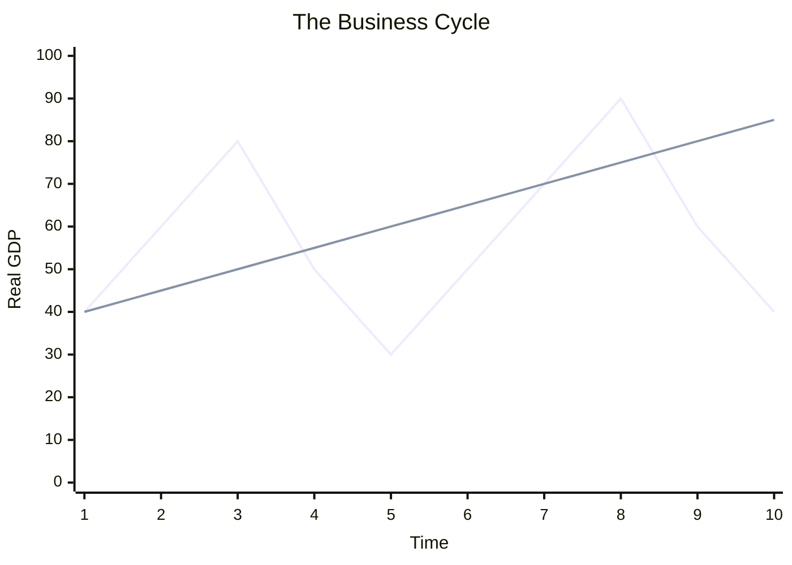

![[2.1_Mindmap.excalidraw.md]]

# 2.1 The Level of Overall Economic Activity

## Definitions
- **Macroeconomics**: The study of the economy as a whole, focusing on aggregates like total output, inflation, unemployment, and economic growth.
- **Circular Flow of Income Model**: A macroeconomic model showing the flow of money, goods, services, and factors of production between households and firms.
- **Leakages (Withdrawals)**: Income that escapes the circular flow (Savings, Taxes, Import spending).
- **Injections**: Income that enters the circular flow from outside (Investment, Government Spending, Export revenue).
- *Equilibrium in the circular flow occurs when: Leakages = Injections (S + T + M = I + G + X).*
- **Gross Domestic Product (GDP)**: The total monetary value of all final goods and services produced within a country's geographic borders in a given time period (usually a year).
- **Gross National Income (GNI)**: The total income earned by a country's factors of production, regardless of where those assets are located. (GDP + Net factor income from abroad).
- **Nominal GDP**: GDP evaluated at current market prices (not adjusted for inflation).
- **Real GDP**: GDP adjusted for inflation (evaluated at constant prices of a base year). Reflects the actual volume of output.
- **Green GDP**: A measure of GDP that accounts for the environmental costs of production (Resource depletion, pollution).
- **Business Cycle**: The natural fluctuation of economic activity over time, consisting of phases: Expansion (Recovery), Peak, Contraction (Recession), and Trough.
- **Recession**: Two consecutive quarters (six months) of negative Real GDP growth.

### Diagram: The Business Cycle

## Formulas

### 1. Three Approaches to Calculating GDP
The theoretical assumption is that **Output = Expenditure = Income**.
1. **Expenditure Approach**: Sum of all spending on final goods and services.
   - **GDP = C + I + G + (X - M)**
     - `C` = Consumption by households
     - `I` = Investment by firms
     - `G` = Government spending
     - `X - M` = Net Exports (Exports minus Imports)
2. **Income Approach**: Sum of all income earned by factors of production.
   - **National Income = Wages (Labor) + Rent (Land) + Interest (Capital) + Profits (Entrepreneurship)**
3. **Output Approach**: Sum of the value added by all sectors of the economy (Primary, Secondary, Tertiary).

### 2. Real GDP Calculation
To remove the effect of inflation and isolate actual growth in output:
**Real GDP = (Nominal GDP / Price Deflator) × 100**

### 3. Economic Growth Rate
**Economic Growth Rate = ((Real GDP Year 2 - Real GDP Year 1) / Real GDP Year 1) × 100**

### 4. GDP per Capita
Used as a basic indicator of standard of living.
**GDP per capita = Total GDP / Total Population**

## Evaluating National Income Statistics
### Limitations of using GDP/GNI as a measure of standard of living:
1. **Does not account for income distribution**: A high GDP doesn't mean wealth is evenly shared (high inequality).
2. **Ignores the informal/underground economy**: Black market, cash-in-hand jobs, and unpaid domestic labor are not recorded.
3. **Ignores environmental degradation**: High GDP from hyper-industrialization may lead to severe pollution, harming living standards.
4. **Does not measure quality of life/composition of output**: An economy producing weapons vs. schools might have the same GDP, but drastically different standards of living. Leisure time and working conditions are also ignored.
